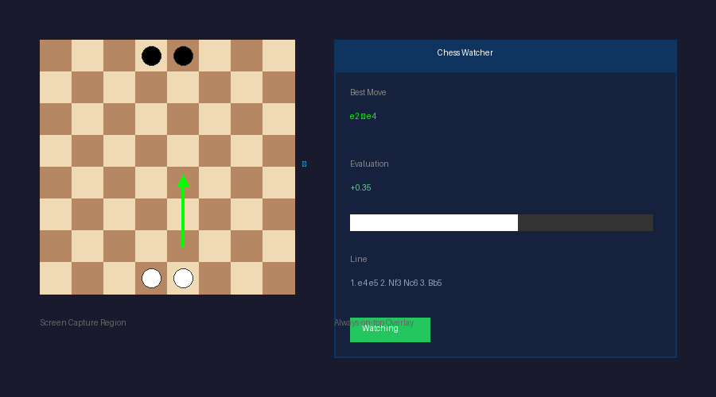

# Chess Screen Analyzer

**Real-Time Chess Position Analysis with Computer Vision**

A desktop application that captures your screen, detects chess board positions using computer vision, and provides real-time analysis using the Stockfish engine. Works with any chess website or application.




## Features

- **Screen Capture** - Select any region of your screen containing a chess board
- **Board Detection** - Computer vision algorithms detect piece positions from screenshots
- **Real-Time Analysis** - Stockfish engine provides best moves and evaluations
- **Always-On-Top GUI** - Compact overlay showing best move, evaluation, and principal variation
- **Auto Stockfish Setup** - Automatic download and configuration of Stockfish engine
- **FEN Export** - Copy detected positions in standard FEN notation

## How It Works

```
┌─────────────────┐     ┌─────────────────┐     ┌─────────────────┐
│  Screen Capture │────▶│ Board Detection │────▶│ Stockfish Engine│
│     (mss)       │     │    (OpenCV)     │     │   Analysis      │
└─────────────────┘     └─────────────────┘     └─────────────────┘
         │                      │                       │
         │                      ▼                       │
         │              ┌─────────────────┐             │
         └─────────────▶│   Tkinter GUI   │◀────────────┘
                        │   (Overlay)     │
                        └─────────────────┘
```

1. **Capture** - Continuously captures the selected screen region
2. **Detect** - Identifies board orientation, squares, and piece positions
3. **Convert** - Translates visual board to FEN notation
4. **Analyze** - Stockfish calculates best moves and evaluation
5. **Display** - Shows results in always-on-top overlay window

## Screenshots

The application provides a compact overlay showing:
- **Best Move** - The recommended move in algebraic notation
- **Evaluation** - Position score with visual eval bar
- **Principal Variation** - Suggested line of play
- **Turn Indicator** - Whose move it is

## Installation

### Requirements

- Python 3.10+
- Windows/macOS/Linux

### Setup

```bash
# Clone the repository
git clone https://github.com/Kizsler/chess-screen-analyzer.git
cd chess-screen-analyzer

# Create virtual environment
python -m venv venv
source venv/bin/activate  # or `venv\Scripts\activate` on Windows

# Install dependencies
pip install -r requirements.txt

# Run the application
python main.py
```

Stockfish will be downloaded automatically on first run.

## Usage

1. **Start the app** - Run `python main.py`
2. **Select region** - Click "Select Board Region" and drag to select your chess board
3. **Start watching** - Click "Start" to begin real-time analysis
4. **Play chess** - The overlay updates automatically as the position changes

### Controls

| Button | Action |
|--------|--------|
| Select Board Region | Define the screen area containing the chess board |
| Start/Stop | Toggle real-time analysis |
| Toggle Turn | Switch between White/Black to move |
| Copy FEN | Copy current position to clipboard |

## Tech Stack

- **GUI**: Tkinter (native Python)
- **Screen Capture**: mss (fast cross-platform screenshots)
- **Computer Vision**: OpenCV + NumPy (board/piece detection)
- **Chess Logic**: python-chess (move validation, FEN handling)
- **Engine**: Stockfish (position analysis)
- **Web UI**: Flask (optional web interface)

## Project Structure

```
chess-screen-analyzer/
├── main.py              # Application entry point & GUI
├── board_detector.py    # Computer vision board detection
├── analyzer.py          # Stockfish engine integration
├── screen_capture.py    # Screen capture utilities
├── region_selector.py   # Board region selection UI
├── config.py            # Configuration management
├── web_ui.py            # Optional Flask web interface
├── requirements.txt     # Python dependencies
├── static/              # Web UI static files
└── templates/           # Web UI templates
```

## Configuration

Settings are stored in `config.json`:

```json
{
  "region": {
    "left": 100,
    "top": 100,
    "width": 600,
    "height": 600
  },
  "stockfish_path": "stockfish/stockfish.exe",
  "analysis_depth": 20,
  "update_interval": 0.5
}
```

## How Board Detection Works

1. **Preprocessing** - Convert screenshot to grayscale
2. **Grid Detection** - Find 8x8 square pattern using edge detection
3. **Square Extraction** - Isolate each of the 64 squares
4. **Piece Recognition** - Match square contents against piece templates
5. **Orientation** - Detect if board is flipped (playing as Black)
6. **FEN Generation** - Convert detected position to FEN string

## Limitations

- Works best with standard piece sets and board colors
- Requires clear view of the entire board
- Some anti-cheat systems may detect screen capture software

## License

MIT

---

**Note:** This tool is intended for analysis of your own games, post-game review, and learning. Please respect the terms of service of chess platforms you use.
